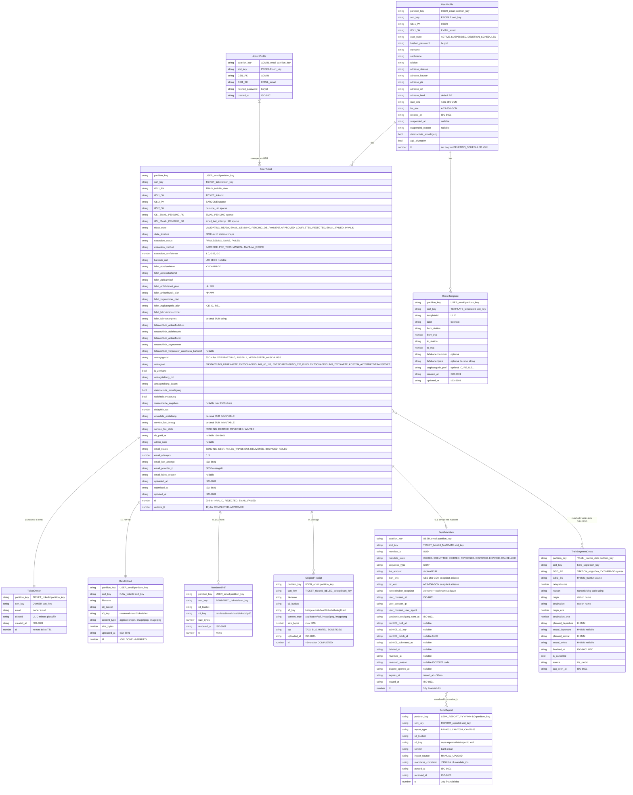

```mermaid
erDiagram
    UserProfile ||--o{ UserTicket : "has"
    UserProfile ||--o{ RouteTemplate : "has"
    AdminProfile }|--|{ UserTicket : "manages via GSI1"
    UserTicket ||--|| TicketOwner : "1:1 ticketId to email"
    UserTicket ||--|| RawUpload : "1:1 raw file"
    UserTicket ||--o| RenderedPdf : "0..1 EU-form"
    UserTicket ||--o{ OriginalReceipt : "0..5 belege"
    UserTicket ||--o| SepaMandate : "0..1 service-fee mandate"
    UserTicket }o--o{ TrainSegmentDelay : "matched trainNr+date GSI1/GSI3"
    SepaMandate }o--o{ SepaReport : "correlated by mandate_id"

    UserProfile {
        string partition_key "USER_email partition_key"
        string sort_key "PROFILE sort_key"
        string GSI1_PK "USER"
        string GSI1_SK "EMAIL_email"
        string user_state "ACTIVE, SUSPENDED, DELETION_SCHEDULED"
        string hashed_password "bcrypt"
        string vorname
        string nachname
        string telefon
        string adresse_strasse
        string adresse_hausnr
        string adresse_plz
        string adresse_ort
        string adresse_land "default DE"
        string iban_enc "AES-256-GCM"
        string bic_enc "AES-256-GCM"
        string created_at "ISO-8601"
        string suspended_at "nullable"
        string suspended_reason "nullable"
        bool datenschutz_einwilligung
        bool agb_akzeptiert
        number ttl "set only on DELETION_SCHEDULED +30d"
    }

    AdminProfile {
        string partition_key "ADMIN_email partition_key"
        string sort_key "PROFILE sort_key"
        string GSI1_PK "ADMIN"
        string GSI1_SK "EMAIL_email"
        string hashed_password "bcrypt"
        string created_at "ISO-8601"
    }

    UserTicket {
        string partition_key "USER_email partition_key"
        string sort_key "TICKET_ticketId sort_key"
        string GSI1_PK "TRAIN_trainNr_date"
        string GSI1_SK "TICKET_ticketId"
        string GSI2_PK "BARCODE sparse"
        string GSI2_SK "barcode_uid sparse"
        string GSI_EMAIL_PENDING_PK "EMAIL_PENDING sparse"
        string GSI_EMAIL_PENDING_SK "email_last_attempt ISO sparse"
        string ticket_state "VALIDATING, READY, EMAIL_SENDING, PENDING_DB_PAYMENT, APPROVED, COMPLETED, REJECTED, EMAIL_FAILED, INVALID"
        string state_timeline "DDB List of state+at maps"
        string extraction_status "PROCESSING, DONE, FAILED"
        string extraction_method "BARCODE, PDF_TEXT, MANUAL, MANUAL_ROUTE"
        number extraction_confidence "1.0, 0.95, 0.0"
        string barcode_uid "UIC 918.3, nullable"
        string fahrt_abreisedatum "YYYY-MM-DD"
        string fahrt_abreisebahnhof
        string fahrt_zielbahnhof
        string fahrt_abfahrtszeit_plan "HH:MM"
        string fahrt_ankunftszeit_plan "HH:MM"
        string fahrt_zugnummer_plan
        string fahrt_zugkategorie_plan "ICE, IC, RE..."
        string fahrt_fahrkartennummer
        string fahrt_fahrkartenpreis "decimal EUR string"
        string tatsaechlich_ankunftsdatum
        string tatsaechlich_abfahrtszeit
        string tatsaechlich_ankunftszeit
        string tatsaechlich_zugnummer
        string tatsaechlich_verpasster_anschluss_bahnhof "nullable"
        string antragsgrund "JSON list: VERSPAETUNG, AUSFALL, VERPASSTER_ANSCHLUSS"
        string antragsart "ERSTATTUNG_FAHRKARTE, ENTSCHAEDIGUNG_60_119, ENTSCHAEDIGUNG_120_PLUS, ENTSCHAEDIGUNG_ZEITKARTE, KOSTEN_ALTERNATIVTRANSPORT"
        bool is_zeitkarte
        string antragstellung_ort
        string antragstellung_datum
        bool datenschutz_einwilligung
        bool wahrheitserklaerung
        string zusaetzliche_angaben "nullable max 2500 chars"
        number delayMinutes
        string erwartete_erstattung "decimal EUR IMMUTABLE"
        string service_fee_betrag "decimal EUR IMMUTABLE"
        string service_fee_state "PENDING, DEBITED, REVERSED, WAIVED"
        string db_paid_at "nullable ISO-8601"
        string admin_note "nullable"
        string email_status "SENDING, SENT, FAILED_TRANSIENT, DELIVERED, BOUNCED, FAILED"
        number email_attempts "0..3"
        string email_last_attempt "ISO-8601"
        string email_provider_id "SES MessageId"
        string email_failed_reason "nullable"
        string uploaded_at "ISO-8601"
        string submitted_at "ISO-8601"
        string updated_at "ISO-8601"
        number ttl "90d for INVALID, REJECTED, EMAIL_FAILED"
        number archive_ttl "10y for COMPLETED, APPROVED"
    }

    RawUpload {
        string partition_key "USER_email partition_key"
        string sort_key "RAW_ticketId sort_key"
        string filename
        string s3_bucket
        string s3_key "raw/email-hash/ticketId.ext"
        string content_type "application/pdf, image/jpeg, image/png"
        number size_bytes
        string uploaded_at "ISO-8601"
        number ttl "+30d DONE +7d FAILED"
    }

    RenderedPdf {
        string partition_key "USER_email partition_key"
        string sort_key "RENDERED_ticketId sort_key"
        string s3_bucket
        string s3_key "rendered/email-hash/ticketId.pdf"
        number size_bytes
        string rendered_at "ISO-8601"
        number ttl "+6mo"
    }

    OriginalReceipt {
        string partition_key "USER_email partition_key"
        string sort_key "TICKET_ticketId_BELEG_belegId sort_key"
        string filename
        string s3_bucket
        string s3_key "belege/email-hash/ticketId/belegId.ext"
        string content_type "application/pdf, image/jpeg, image/png"
        number size_bytes "max 5MB"
        string typ "TAXI, BUS, HOTEL, SONSTIGES"
        string uploaded_at "ISO-8601"
        number ttl "+6mo after COMPLETED"
    }

    SepaMandate {
        string partition_key "USER_email partition_key"
        string sort_key "TICKET_ticketId_MANDATE sort_key"
        string mandate_id "ULID"
        string mandate_state "ISSUED, SUBMITTED, DEBITED, REVERSED, DISPUTED, EXPIRED, CANCELLED"
        string sequence_type "OOFF"
        string fee_amount "decimal EUR"
        string iban_enc "AES-256-GCM snapshot at issue"
        string bic_enc "AES-256-GCM snapshot at issue"
        string kontoinhaber_snapshot "vorname + nachname at issue"
        string user_consent_at "ISO-8601"
        string user_consent_ip
        string user_consent_user_agent
        string vorabankuendigung_sent_at "ISO-8601"
        string pain008_built_at "nullable"
        string pain008_s3_key "nullable"
        string pain008_batch_id "nullable ULID"
        string pain008_submitted_at "nullable"
        string debited_at "nullable"
        string reversed_at "nullable"
        string reversed_reason "nullable ISO20022 code"
        string dispute_opened_at "nullable"
        string expires_at "issued_at + 36mo"
        string issued_at "ISO-8601"
        number ttl "10y financial doc"
    }

    SepaReport {
        string partition_key "SEPA_REPORT_YYYY-MM-DD partition_key"
        string sort_key "REPORT_reportId sort_key"
        string report_type "PAIN002, CAMT054, CAMT053"
        string s3_bucket
        string s3_key "sepa-reports/date/reportId.xml"
        string sender "bank email"
        string ingest_source "MANUAL_UPLOAD"
        string mandates_correlated "JSON list of mandate_ids"
        string parsed_at "ISO-8601"
        string received_at "ISO-8601"
        number ttl "10y financial doc"
    }

    TrainSegmentDelay {
        string partition_key "TRAIN_trainNr_date partition_key"
        string sort_key "SEG_segId sort_key"
        string GSI3_PK "STATION_originEva_YYYY-MM-DD sparse"
        string GSI3_SK "HH:MM_trainNr sparse"
        number delayMinutes
        string reason "numeric fchg code string"
        string origin "station name"
        string destination "station name"
        number origin_eva
        number destination_eva
        string planned_departure "HH:MM"
        string actual_departure "HH:MM nullable"
        string planned_arrival "HH:MM"
        string actual_arrival "HH:MM nullable"
        string finalized_at "ISO-8601 UTC"
        bool is_cancelled
        string source "iris, piebro"
        string last_seen_at "ISO-8601"
    }

    RouteTemplate {
        string partition_key "USER_email partition_key"
        string sort_key "TEMPLATE_templateId sort_key"
        string templateId "ULID"
        string label "free text"
        string from_station
        number from_eva
        string to_station
        number to_eva
        string fahrkartennummer "optional"
        string fahrkartenpreis "optional decimal string"
        string zugkategorie_pref "optional IC, RE, ICE..."
        string created_at "ISO-8601"
        string updated_at "ISO-8601"
    }

    TicketOwner {
        string partition_key "TICKET_ticketId partition_key"
        string sort_key "OWNER sort_key"
        string email "owner email"
        string ticketId "ULID mirrors pk suffix"
        string created_at "ISO-8601"
        number ttl "mirrors ticket TTL"
    }
```
